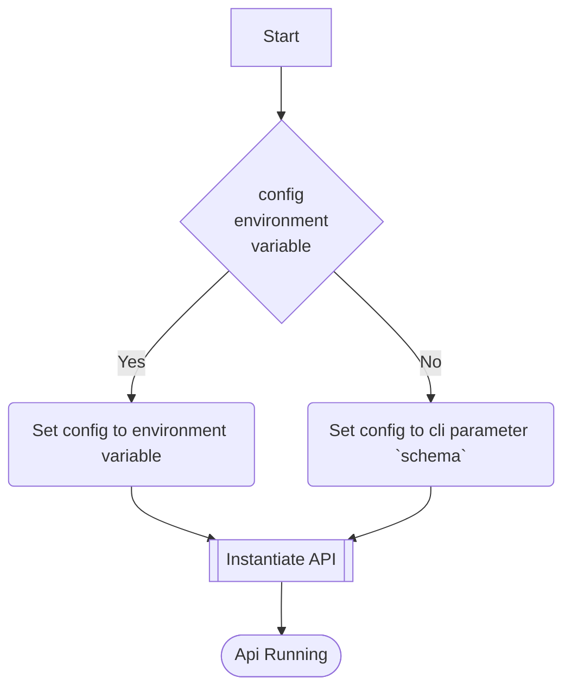
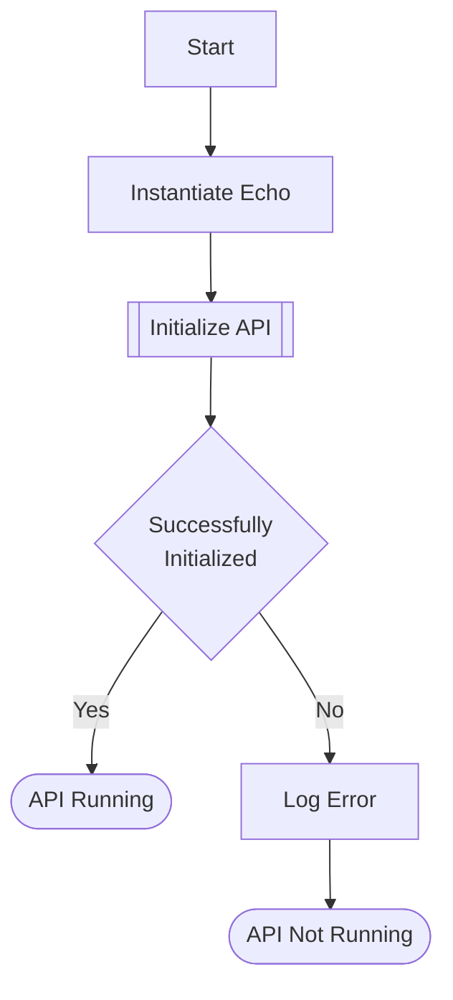
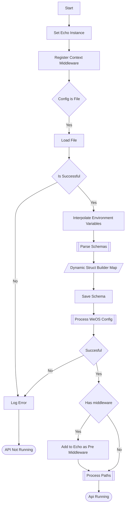
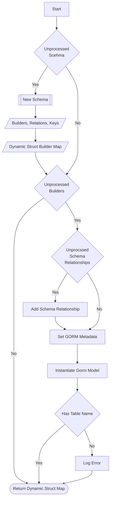
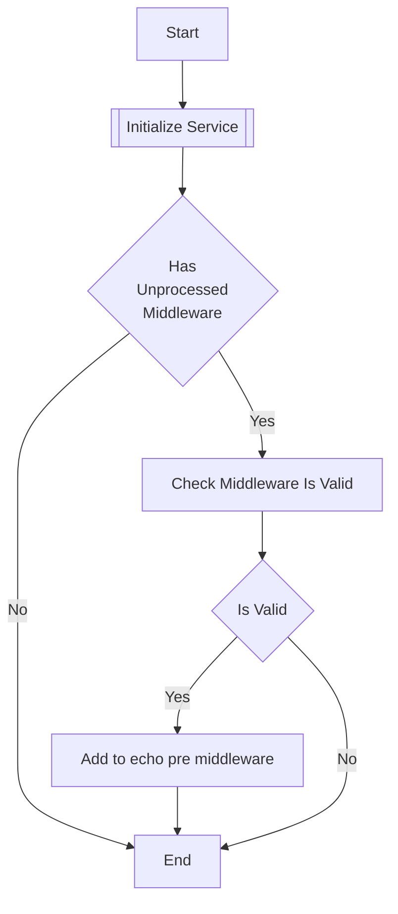
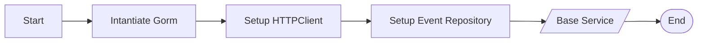
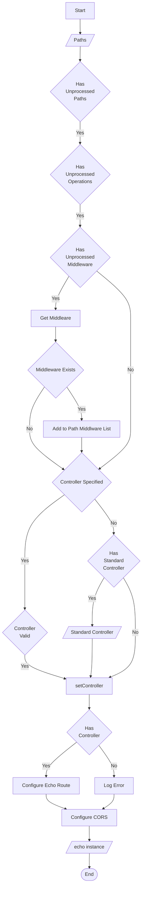

# API Startup Flow Chart

## Main entrypoint 

The OpenAPI spec can be passed to the CLI via environment variable `WEOS_SCHEMA` or as a command line argument `schema`. 
The value for the OpenAPI spec could be the contents of a valid spec or the filepath to the specification

### Instantiate API

#### Initialize API

##### Parse Schemas
This is where the OpenAPI schemas are converted to GORM models 

##### Process WeOS Config
The `x-weos-config` contains the database configuration that is used to instantiate a database connection. It also contains
REST middleware configuration 

###### Initialize Service
Each API extends a base `Service` that WeOS provides. When a service is instantiated the db connections are setup using 
`database` configuration in the `x-weos-config`

##### Setup Paths 
Each path in the OpenAPI spec is processed and the relevant middleware, controllers are associated

