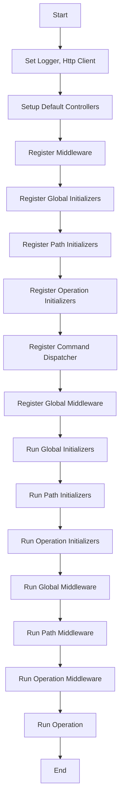

# API Startup Flow Chart

## Main entrypoint 

The OpenAPI spec can be passed to the CLI via environment variable `WEOS_SCHEMA` or as a command line argument `schema`. 
The value for the OpenAPI spec could be the contents of a valid spec or the filepath to the specification

### Instantiate API

The api is instantiated calling api.New(). The openapi spec is passed to the api.New() function as a file path or as a string.
The `api.New()` function instantiates the echo framework and then initializes the api. An instance of the api is returned
and the api instance is essentially a service container that can be used to access other services.

For a quick start you can use `api.Start()` instead of `api.New()`

### Initialize API

During the initialization of the api the following steps are performed:
1. Setup default logger, http client in service container
2. Register standard controllers 
3. Register standard middleware
4. Register standard global initializers
5. Register standard operation initializers
6. Setup the default command dispatcher
7. Setup global middleware
8. Run global initializers
9. Run path initializers
10. Run operation initializers

##### Process WeOS Config
The `x-weos-config` contains the database configuration that is used to instantiate a database connection. It also contains
REST middleware configuration 

###### Initialize Service
Each API extends a base `Service` that WeOS provides. When a service is instantiated the db connections are setup using 
`database` configuration in the `x-weos-config`

##### Setup Paths 
Each path in the OpenAPI spec is processed and the relevant middleware, controllers are associated

