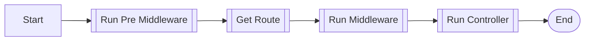
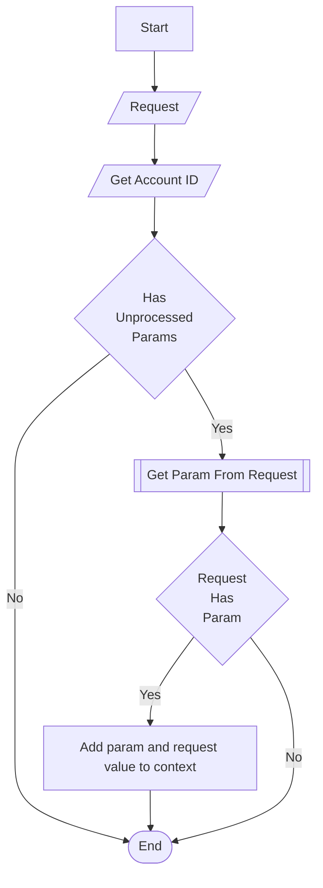
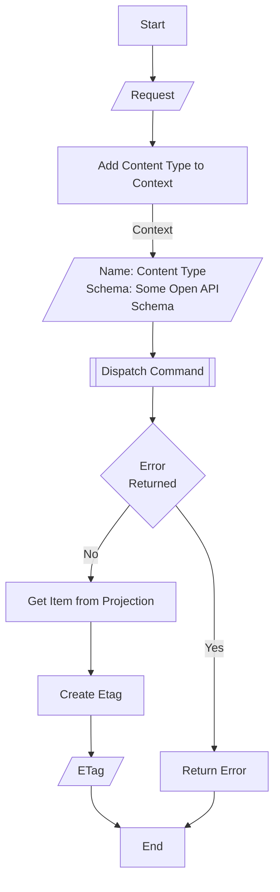

# WeOS Rest Endpoint Request Flow
This shows what happens with an incoming request to an endpoint

## Pre Middleware 
We have standard middleware that we typically use 
- RequestID - Generate request id 
- Recover - Return friendly error when there is a panic
- ZapLogger - Switches to using Zap logger instead of echo logger 

## Get Route 
Uses echo framework functionality. 

## Run Middleware
Middleware are run in the order in which they are configured on the path. 

### Context Middleware
By default a Context Middleware is set which adds values in the request based on the parameters configured on that path
in the OpenAPI spec.

## Run Controller
The controller that is run is either explicitly set using the `x-controller` extension or automatically configured. 
### Standard Create Controller

