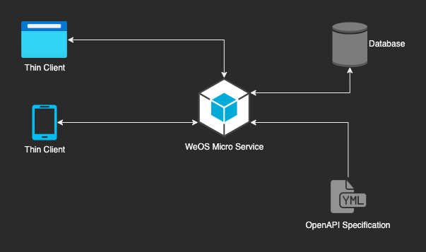

# WeOS Service

WeOS is an open-source system for creating APIs and applications. We've made it easy to get started with the microservice
architecture by providing APIs that combine an [OpenAPI specification](https://spec.openapis.org/oas/latest.html) and an
executable (no Docker required). You can also create sophisticated services using our pre-built controllers and
middleware. No matter what you're trying to build (mobile app, web app, SaaS), our APIs can help.

## How It Works

    

We've built an executable that can process an OpenAPI specification and combine it with shared business logic to make
APIs (WeOS Services) that you can use to create applications. We developed the executable in Go to be cross-platform,
easy to deploy (no Docker required), and easy to maintain. You can use Open API to model your data, create data stores, 
configure routes and set up functionality for endpoints. You can also configure middleware to make sophisticated
microservices.

There is also support for the odbc driver